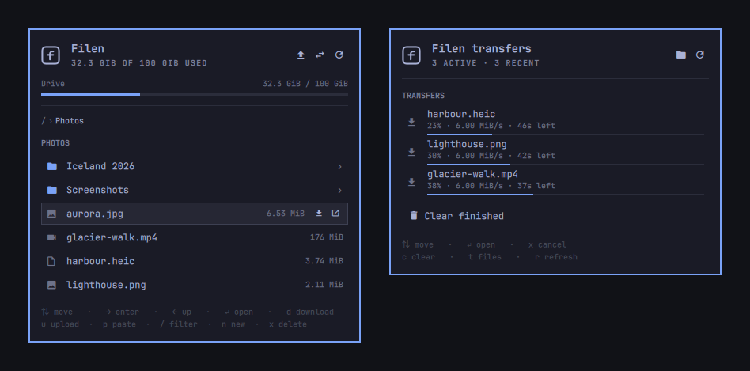
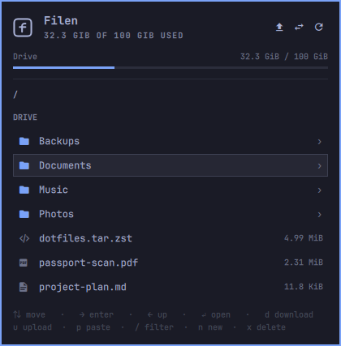
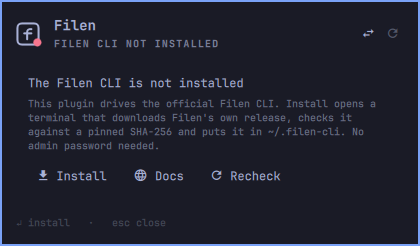
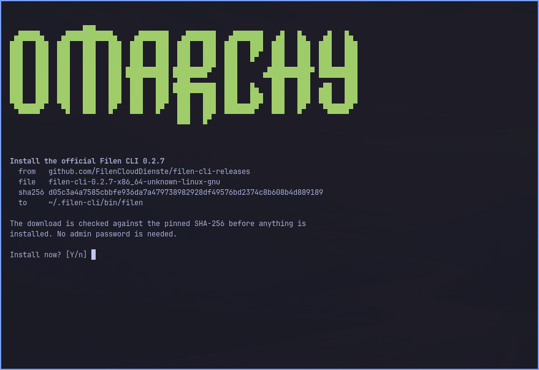
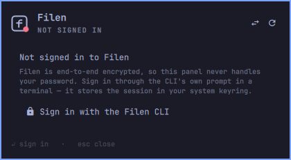

# Filen for Omarchy

An [Omarchy Quattro](https://omarchy.org) shell plugin that puts your
[Filen](https://filen.io) end-to-end encrypted drive in the bar: browse it,
download and open files in your normal viewers, upload into it, and watch
transfers — without a browser or memorising CLI flags.

Built for the Quickshell-based Omarchy 4 shell. Tested against Omarchy
`4.0.0` and Filen CLI `0.2.7`.



<sub>Screenshots use a made-up demo drive.</sub>

> Independent community plugin. Not affiliated with or endorsed by Filen.

## What it does

**Bar widget** — the Filen mark, dimmed when idle, with a count of running
transfers and a dot when something needs attention.

**Panel** (click, or `omarchy-shell filen toggle`)

- Drive quota meter with used/total
- File browser with breadcrumb, folders first, natural sort, real sizes
- Type-aware icons; `Enter` on an image/video/PDF downloads it and opens it
  in **your** configured viewer (imv, mpv, evince — via `xdg-open`)
- Filter within a folder (`/`)
- Upload via the desktop file chooser (`u`) or from the clipboard (`p`)
- Create folders (`n`), delete to Filen trash with confirmation (`x`)
- Transfers view (`t`) with live percentage, speed, ETA and working cancel



### Keys

| Key | Browser | Transfers |
|---|---|---|
| `↑ ↓` / `j k` | move cursor | move cursor |
| `→` / `l` | enter folder | — |
| `←` / `h` / `Backspace` | up a folder | — |
| `Enter` | folder: open · file: download & open | open finished download |
| `o` | download and open | — |
| `d` | download only | — |
| `u` | upload via file chooser | — |
| `p` | upload paths from clipboard | — |
| `n` | new folder | — |
| `y` | copy the remote path | — |
| `x` | delete (to trash, confirmed) | cancel transfer |
| `/` | filter this folder | — |
| `r` | refresh | refresh |
| `t` | transfers view | back to files |
| `w` | open the web drive | — |
| `c` | — | clear finished |
| `Esc` | clear filter / close | back to files |

## Install

```bash
omarchy plugin add https://github.com/Zeus-Deus/filen-omarchy-plugin --enable --yes
```

The plugin needs the official **Filen CLI** (the Rust rewrite). If it is
missing, the panel says so and offers **Install**:



**Install** (or `Enter`) opens Omarchy's floating terminal running
[`scripts/install-cli.sh`](scripts/install-cli.sh). It shows exactly what it
will fetch and asks before doing anything:



It downloads Filen's own release from
[`filen-cli-releases`](https://github.com/FilenCloudDienste/filen-cli-releases),
refuses to install unless the SHA-256 matches the value pinned in the script,
and puts the binary in `~/.filen-cli/bin/filen`. It needs no admin password
and does not edit your shell config. A newer CLI only arrives with a new
plugin version. The panel notices the CLI as soon as it lands.

To install it by hand instead, check the binary against the digest GitHub
publishes for the asset
(shown on the [release page](https://github.com/FilenCloudDienste/filen-cli-releases/releases)):

```bash
mkdir -p ~/.filen-cli/bin
curl -fL -o ~/.filen-cli/bin/filen \
  https://github.com/FilenCloudDienste/filen-cli-releases/releases/download/0.2.7/filen-cli-0.2.7-x86_64-unknown-linux-gnu
echo "d05c3a4a7585cbbfe936da7a479738982928df49576bd2374c8b608b4d889189  $HOME/.filen-cli/bin/filen" | sha256sum -c
chmod 755 ~/.filen-cli/bin/filen
```

The plugin finds `filen` on your `PATH` or in `~/.filen-cli/bin`. Then open
the panel and press **Sign in with the Filen CLI** (or `Enter`):



That opens a terminal running the CLI's own prompt. Answer `y` to stay signed in, and the CLI keeps
the session in your system keyring. You can also run `filen stat /` yourself.

The first listing downloads rclone into `~/.config/filen-cli/rclone/`. The
CLI's managed rclone is checksum-pinned in the CLI's source.

## Remove

```bash
omarchy plugin remove io.github.zeus-deus.filen
```

Removal deletes the plugin folder and its bar entry. The plugin keeps no
data of its own. Downloaded files stay where you saved them. Your Filen
session and the CLI stay installed too, because they belong to the CLI and
not to the plugin. To sign out and delete the CLI's saved keys, run this
before removing it. The `rm` is not optional. In CLI 0.2.7, `filen logout`
clears the keyring but leaves `~/.config/filen-cli/rclone/rclone.conf` behind,
and that file still has working keys for the whole drive:

```bash
filen logout
rm -rf ~/.config/filen-cli ~/.filen-cli
```

## Dependencies

- The Filen CLI `0.2.x` (see Install; the panel can install it for you).
- Omarchy's own `omarchy-file-select`, `omarchy-launch-terminal` and
  `omarchy-launch-browser`, plus `wl-copy`, `wl-paste`, `xdg-open`,
  `notify-send` and `setsid`. All of these ship with Omarchy.

## Settings

Configurable in `Setup > Plugins`, stored inline in `~/.config/omarchy/shell.json`.

| Setting | Default | Meaning |
|---|---|---|
| `refreshIntervalSec` | 300 | Background quota refresh (60–3600) |
| `downloadDir` | `~/Downloads` | Where downloads land; validated |
| `confirmDelete` | `true` | Confirm before moving to Filen trash |
| `bandwidthLimit` | *(empty)* | e.g. `2M`, `500K`; empty = unlimited |

## Security

Filen is zero-knowledge, and this plugin runs **unsandboxed inside the
Omarchy shell process**. The design follows from those two facts. The plugin
is a front end to the official CLI. All encryption, decryption and
networking with Filen happens inside the CLI and its managed rclone.

- **No network of its own.** No telemetry, analytics or version check, and
  nothing is sent anywhere but Filen. The plugin's only direct connection is
  a TCP connect-and-close to `gateway.filen.io:443`. It runs only after a
  failed command, to tell "offline" apart from "signed out", and it sends no
  data. The `w` key and the install-docs button open `app.filen.io` /
  `docs.filen.io` in your browser. The CLI installer (below) downloads from
  Filen's GitHub releases, and only when you run it.
- **Your password never touches the plugin.** There is no password field.
  Sign-in happens in a real terminal running the CLI's own prompt, and the
  CLI stores the session in the system keyring.
- **No secrets in argv.** `/proc/<pid>/cmdline` is world-readable. Verified
  at runtime during a live transfer: the command lines contain only paths
  and flags.
- **No credential env vars.** `FILEN_CLI_PASSWORD` / `FILEN_CLI_EMAIL` are
  never set, so nothing leaks into child processes.
- **The auth config is never read.** `filen-cli-auth-config.txt` holds master
  keys, the private key and the API key in plaintext. The plugin never reads,
  copies or displays it, and never calls `export-api-key` /
  `export-auth-config`.
- **No shell.** Every command is an argv array, so a filename containing
  `;`, `$()`, backticks or newlines is inert data. Native verbs get `--` so a
  name starting with `-` can't become a flag.
- **Remote output is treated as hostile.** Names come from shared folders and
  can be anything. Responses are size-capped, JSON is parsed defensively, and
  displayed text is stripped of control characters and bidi overrides, then
  rendered as `PlainText`.
- **Downloads are written under a sanitized name and never overwrite.**
  The remote path stays byte-exact so the right object is fetched. The local
  filename has bidi and control characters removed. Without this, a drive
  file called `ev<U+202E>gnp.exe` would land on your disk displaying as
  `evexe.gnp`. If the name is already taken, the download is saved as
  `name (1).ext` and your existing file is left alone.
- **Only viewable types are auto-opened.** `Enter`/`o` hands images, video,
  audio, PDFs and plain text to `xdg-open`. Launchers (`.desktop`), scripts,
  HTML, SVG and executables are downloaded and then shown in their folder,
  never opened. A shared folder can contain anything, and `xdg-open` would
  run those files.
- **The updater never fires on its own.** Every call passes `--skip-update`;
  updating the CLI is your decision.
- **Deletes go to the Filen trash** and are confirmation-gated by default.
  The plugin can never empty the trash or permanently delete.
- **It checks the CLI's own key file.** The Filen CLI writes
  `~/.config/filen-cli/rclone/rclone.conf` with `master_keys`, `api_key`
  and `private_key` in plaintext, as mode **0644**
  ([reported upstream](https://github.com/FilenCloudDienste/filen-rs/issues/16)).
  Omarchy's `0700` home directory already keeps other users out, so the
  panel warns only when another user could actually reach the file. It
  offers to lock `~/.config/filen-cli` to `0700`. That fix persists, even
  though the CLI recreates the file on each sign-in. The plugin only
  `stat`s the file and never reads it.

### What a reviewer will flag

The marketplace's automated baseline reports one capability, **`installer`**,
and no findings. It comes from `scripts/install-cli.sh`, which exists so a
missing Filen CLI can be installed from the panel:

- It runs only when you press **Install** (or `Enter`) on the "CLI not
  installed" panel (`Service.qml:607`). The panel launches Omarchy's
  `omarchy-launch-floating-terminal-with-presentation` with a fixed command
  (the script's path in the plugin folder). Nothing from the drive, the
  settings or the CLI is put into it. Nothing runs when the plugin is
  installed.
- The script shows the source, file, pinned SHA-256 and destination, and
  asks before doing anything. It downloads one file, over HTTPS only, from
  `github.com/FilenCloudDienste/filen-cli-releases` (Filen's own release
  repository) for the pinned version 0.2.7 (`install-cli.sh:58`). Then it
  checks it with `sha256sum -c` against the digest pinned per architecture
  (`install-cli.sh:62`). Nothing is executed or moved into place before that
  check passes. On a mismatch, failed download or "n", it stops with
  "Nothing changed". The digests match the ones GitHub publishes for those
  release assets.
- It installs to `~/.filen-cli/bin/filen` only. It needs no admin rights and
  does not edit shell config, systemd or anything outside that folder. A
  newer CLI arrives only with a new plugin commit, which gets its own review.
  The CLI's updater is never run (`--skip-update` on every call).

Everything else the plugin runs is a binary that ships with Omarchy or the
Filen CLI, each started as a fixed argv. There are no bundled binaries, no
build step, no service units and no package-manager calls.

Run the audits:

```bash
./scripts/security-audit.sh    # 29 static checks over the source
./scripts/security-runtime.sh  # 7 checks against live processes
```

## Notes on the Filen CLI

Findings from reading the source and testing v0.2.7 — useful if you extend
this:

- The **TypeScript CLI is sunset**; this targets the Rust rewrite
  (`filen-rs/filen-cli`), currently public beta.
- **Failures print to stdout, not stderr.** Classify on both or a signed-out
  account reads as signed in.
- v0.2.7 has **no `upload`/`download` subcommand** — those exist only on git
  `main`. Transfers go through the bundled rclone (`filen rclone copyto`).
- Native `ls --json` returns **names only**. `filen rclone lsjson` returns
  name + size + mtime + MIME + IsDir in one call, so the browser uses that
  instead of one `stat` per row.
- **Offline is indistinguishable from signed-out** by message alone; both
  produce `Failed to read input from terminal`. The plugin probes
  connectivity before claiming your session is gone.
- Each `filen rclone` run **rewrites `rclone.conf`** as it starts. Two
  overlapping runs can catch it mid-write (`didn't find section in config
  file`), so metadata calls are serialised and retried.
- `filen` spawns rclone as a **child in the caller's process group**, so
  cancelling requires `setsid` + a group signal.

## Development

```bash
node --test tests/model.test.js   # 88 unit tests, no Qt needed
omarchy plugin validate .
./scripts/dev-reload.sh           # sync, test, restart shell, check for errors
```

`tests/mock-filen` is a fake CLI for exercising states that are hard to
reproduce live (signed out, empty drive, garbage JSON, huge listings, slow
transfers). Point the plugin at it by putting it earlier in `PATH`. Its
`rclone about` / `lsjson` / `copyto` output is the made-up demo drive the
screenshots use.

Architecture, conventions and traps: see [docs/DEVELOPMENT.md](docs/DEVELOPMENT.md).

## Licence

MIT
